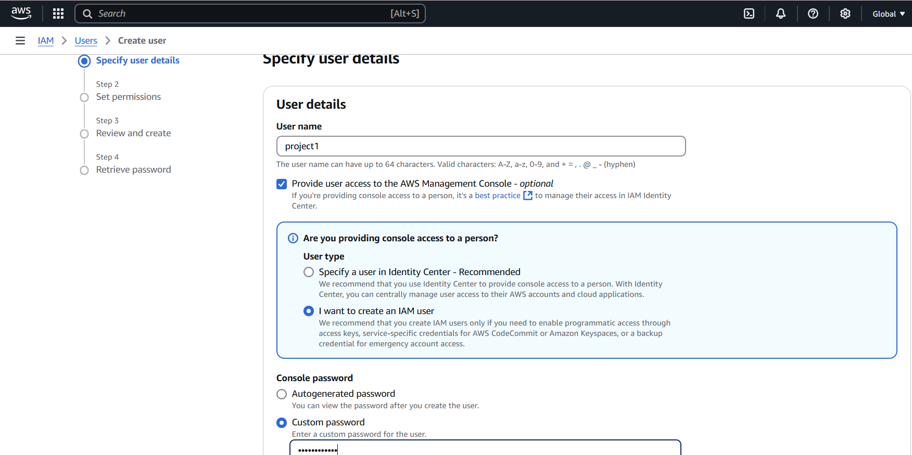
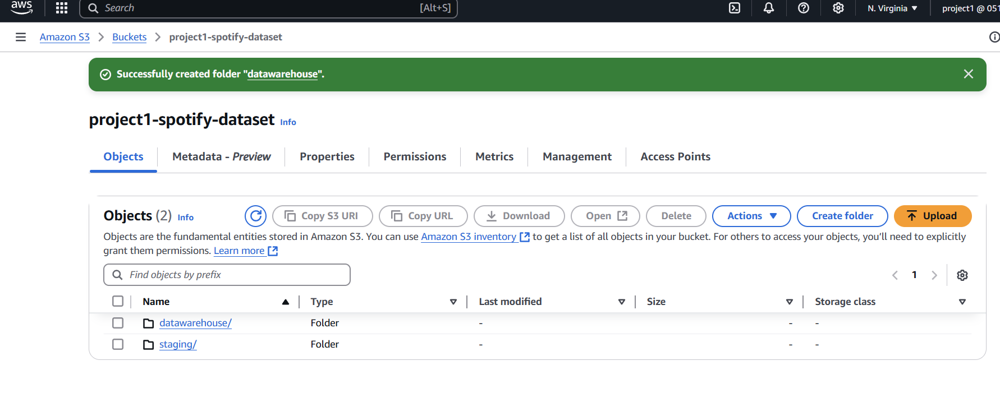
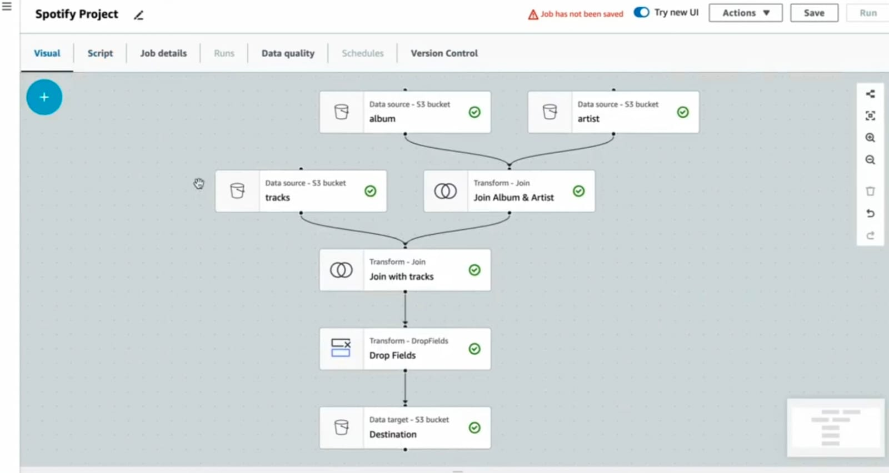
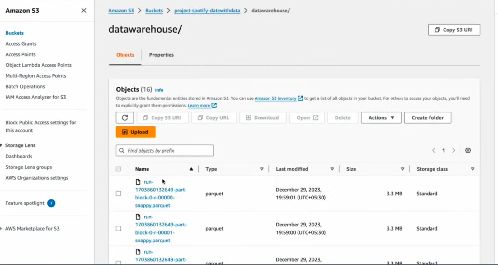
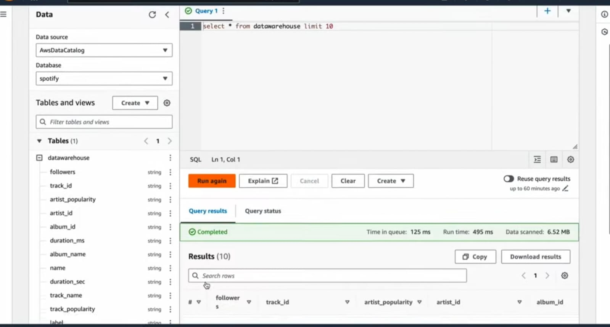

# Spotify Data Analysis using AWS


## **Project Description**
This project analyzes Spotify datasets to uncover insights related to song trends, genres, and popularity. The raw data, sourced from [Kaggle](https://www.kaggle.com/datasets/tonygordonjr/spotify-dataset-2023), was initially provided in CSV format. The dataset contained valuable information, but it required extensive cleaning and transformation to make it suitable for analysis.

I utilized AWS services including S3, Glue, and Athena to handle, transform, and analyze the data. Key steps included:

- **Merging Multiple CSV Files**: The data was split into multiple files such as `album.csv`, `artist.csv`, and `tracks.csv`. These files were merged using common fields like album and artist IDs to create a consolidated dataset.
- **Data Cleaning**: Using **Pandas** and **PySpark**, I handled missing values, removed duplicates, and dropped irrelevant columns. This ensured the data was ready for analysis.
- **Transformation**: The data was then transformed into a more efficient Parquet format using AWS Glue, optimizing it for faster querying and storage.
- **Querying and Analysis**: The transformed data was stored in AWS S3 and insights were derived using SQL queries in AWS Athena.

This project offers a comprehensive data pipeline, from raw data ingestion and transformation to insightful data analysis, showcasing the power of AWS cloud technologies.


## **Table of Contents**
- [Spotify Data Analysis using AWS](#spotify-data-analysis-using-aws)
  - [**Project Description**](#project-description)
  - [**Table of Contents**](#table-of-contents)
  - [**Features**](#features)
  - [**Tech Stack**](#tech-stack)
  - [Data Workflow](#data-workflow)
  - [**Setup Guide**](#setup-guide)
    - [Step 1: Create an IAM User](#step-1-create-an-iam-user)
    - [Step 2: Log In with IAM Credentials](#step-2-log-in-with-iam-credentials)
    - [Step 3: Set Up S3 Bucket](#step-3-set-up-s3-bucket)
    - [Step 4: Create a Database in AWS Glue](#step-4-create-a-database-in-aws-glue)
    - [Step 5: Create a Table using AWS Glue Crawlers](#step-5-create-a-table-using-aws-glue-crawlers)
    - [Step 6: Create and Run an ETL Job in AWS Glue](#step-6-create-and-run-an-etl-job-in-aws-glue)
    - [Step 7: Query the Transformed Data in AWS Athena](#step-7-query-the-transformed-data-in-aws-athena)


---
## **Features**
- **Storage of raw CSV data in AWS S3**: Secure and scalable storage for large datasets.
- **Transformation of data into Parquet format using AWS Glue**: Optimizes storage and query performance.
- **Querying the transformed data with AWS Athena**: Enables fast SQL-based analysis on the cleaned and transformed data.
- **Visual Insights**: Generated meaningful visual insights based on the transformed data.

## **Tech Stack**
- **Data Formats**: CSV (input), Parquet (output)
- **AWS Services**: S3, Glue, Athena
- **Data Transformation Tools**: Pandas, PySpark

## Data Workflow
1. **Input Data**: Raw CSV files are uploaded to S3.
2. **ETL Process**: AWS Glue processes and transforms the CSV files into Parquet format.
3. **Analysis**: 

---

## **Setup Guide**

### Step 1: Create an IAM User
1. Log in to the AWS Management Console with your root account.
2. Navigate to **IAM** (Identity and Access Management) service.
3. Create a new IAM user with the following details:
   - **Access Type**: Programmatic access and AWS Management Console access.
   - **Permissions**: Attach the following policies:
     - `AmazonS3FullAccess`
     - `AWSGlueServiceRole`
     - `AmazonAthenaFullAccess`
   - Download and save the **Access Key ID** and **Secret Access Key** securely.


### Step 2: Log In with IAM Credentials
1. Go to the AWS Management Console login page.
2. Enter the **IAM User Sign-In URL** provided during user creation.
3. Log in using the IAM credentials created in the previous step.


### Step 3: Set Up S3 Bucket

1. Go to the **S3 service** in the AWS Management Console.
2. Create a new bucket with the name `project1-spotify-dataset`.
   - Ensure the bucket name is unique across all AWS accounts.
   - Choose your preferred region.
   - Keep the default settings unless specified otherwise.
3. After creating the bucket, create two folders inside it:
   - **staging**: For uploading raw input data (e.g., CSV files).
   - **datawarehouse**: For storing transformed Parquet files.



### Step 4: Create a Database in AWS Glue

1. Navigate to the **AWS Glue Dashboard** in the AWS Management Console.
2. Click on **Databases** in the left-hand menu.
3. Select **Add Database** and provide the following details:
   - **Database Name**: `spotify`
4. Save the database.

This database will be used to catalog and query the Spotify datasets.

### Step 5: Create a Table using AWS Glue Crawlers

1. Go to the **AWS Glue Dashboard** in the AWS Management Console.
2. Click on **Crawlers** in the left-hand menu and select **Add Crawler**.
3. Provide the following details during the setup:
   - **Name**: `spotify-staging-crawler`
   - **Data Source**: Point the crawler to the `staging/` folder in the `project1-spotify-dataset` S3 bucket.
   - **IAM Role**: Select or create an IAM role that has necessary permissions for S3 and Glue.
   - **Output Database**: Choose the `spotify` database created earlier.
4. Run the crawler to detect the schema and create a table in the Glue Data Catalog.
5. Once the crawler completes, verify the table schema under the `spotify` database in the Glue Data Catalog.

### Step 6: Create and Run an ETL Job in AWS Glue

1. **Navigate to the AWS Glue Dashboard**:
   - Click on **Jobs** in the left-hand menu and select **Add Job with Visual ETL**.

2. **Create Visual Job Flow**:
   - Select the **Visual** job option and open the visual job editor.


3. **Select Source**:
   - **Source**: Point to the `staging/` folder in the S3 bucket (`project1-spotify-dataset`).
  

4. **Perform Transformations**:
   - **Step 1**: Join `album.csv` and `artist.csv` files using the common field(s).
   - **Step 2**: Use the output from Step 1 and join it with `tracks.csv`.
   - **Step 3**: Add a **Transform Field** step to drop unnecessary fields.
   - **Step 4**: Remove duplicates from the data as needed.
   - **Step 5**: Add another **Transform Field** step to configure the data for loading into the target location.

5. **Select Target**:
     - **Target**: Specify the `datawarehouse/` folder in the S3 bucket.


6. **Configure Job Execution**:
   - Specify the following:
     - **Script Configuration**: Verify the auto-generated ETL script.
     - **Job Details**: Review job name, description, and runtime environment.
     - **Worker Nodes**: Select the number of nodes and configure CPU and RAM based on data size.
   - Ensure that the IAM role has sufficient Glue and S3 permissions.



8. **Save and Run the Job**:
   - Save the job configuration.
   - Click on **Run Job** to start the ETL process.

9. **Monitor the Job**:
   - Check the status of the ETL job in the Glue console. It may take some time to complete.
   - Once completed, the transformed data will be available in the `datawarehouse/` folder of the S3 bucket.



### Step 7: Query the Transformed Data in AWS Athena

1. **Create an S3 Bucket for Athena Query Results**:
   - Go to the **S3** service in the AWS Management Console.
   - Create a new S3 bucket, for example: `athena-query-results`.
   - This bucket will store the query results generated by Athena.

2. **Navigate to AWS Athena**:
   - Go to the **Athena Dashboard** in the AWS Management Console.
   - On the left sidebar, select the **spotify** database created earlier.

3. **Set Query Results Location**:
   - In the Athena console, click on **Settings** in the top-right corner and specify the newly created S3 bucket (`athena-query-results`) as the location for query results.

4. **Write the Query**:
   - In the query editor, write your first query to fetch data:
     ```sql
     SELECT * FROM spotify_table_name LIMIT 10;
     ```
     Replace `spotify_table_name` with the actual table name from the Glue database.

5. **Run the Query**:
   - Click on **Run Query**. The query results will be stored in the specified S3 bucket.

6. **View Results**:
   - After the query finishes, check the S3 bucket for the output results file.




